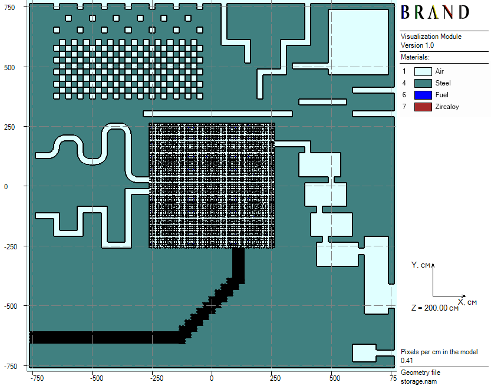
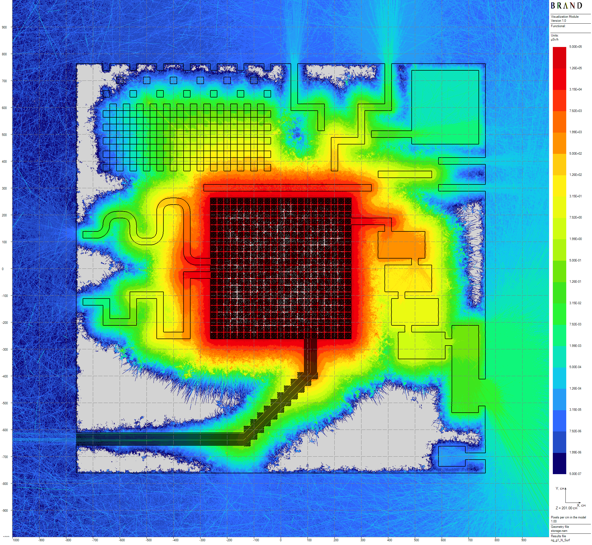
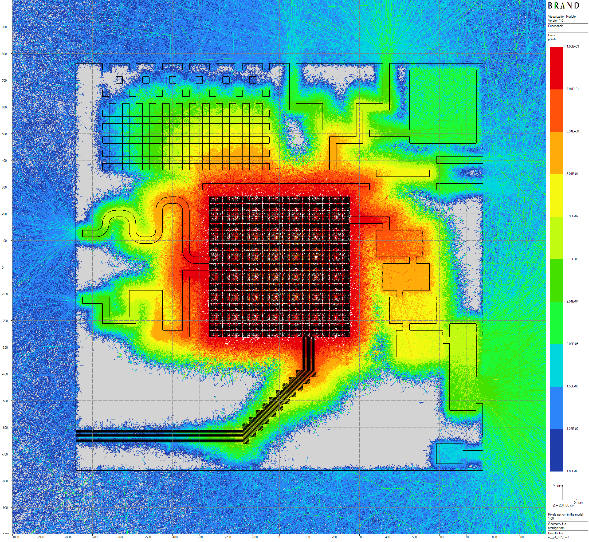
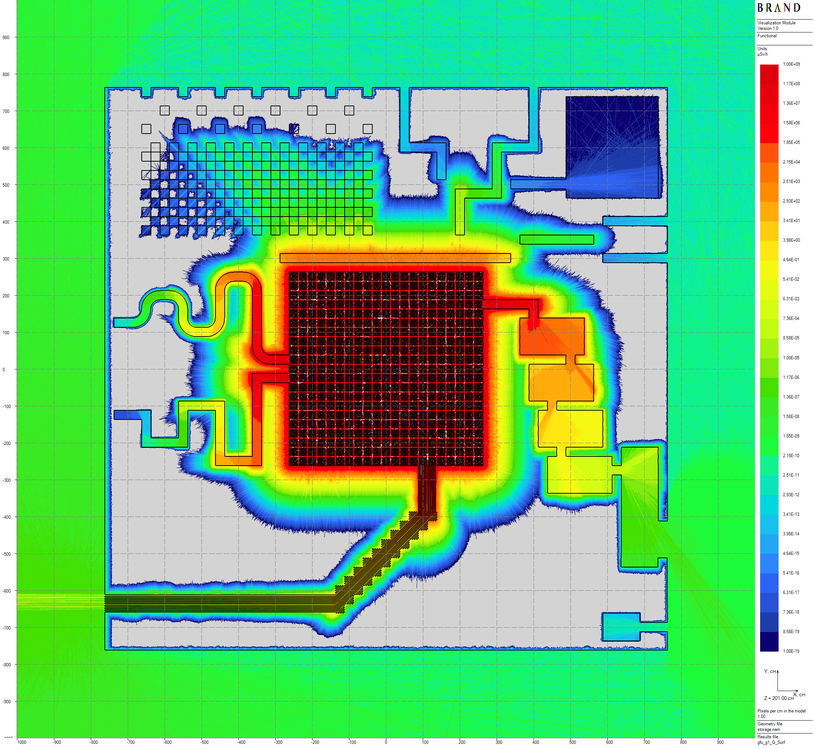

[Prev](anthill.md) [**.....**](shielding-evaluations.md#computations-results)

# Steel Anthill toy model

All of the model parameters are the same as in [Concrete Anthill](anthill.md) but steel is used as a shielding material instead of concrete one.

||
|:--:|
| Figure 1: Horizontal model cross-section |

Computed flux functional - ambient equivalent dose H*(10) [1] rates, the thickness of volumetric detectors are 100 cm.
Below, some results of neutron-gamma and gamma problems 20.5 hours long computation are presented.

||
|:--:|
| Figure 2: Neutron horizontal dose rates distribution |

||
|:--:|
| Figure 3: Secondary gamma horizontal dose rates distribution |

||
|:--:|
| Figure 4: Primary gamma horizontal dose rates distribution |

[Prev](anthill.md) [**.....**](shielding-evaluations.md#computations-results)

# References
1. International Commission on Radiological Protection., International Commission on Radiation Units,
and Measurements. Conversion coefficients for use in radiological protection against external radiation.
Annals of the ICRP ; v. 26, no. 3/4. Published for the Commission by Pergamon Press, Oxford ;, 1st
ed. edition, 1996 - 1997.

Copyright &copy; 2025 Vitaly Mogulian
