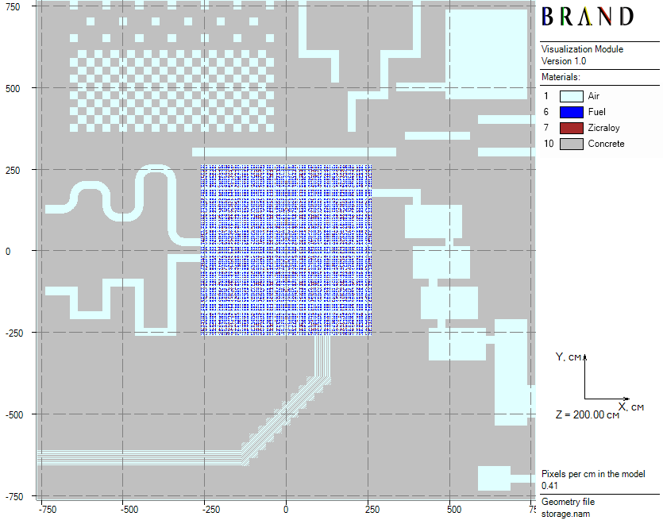
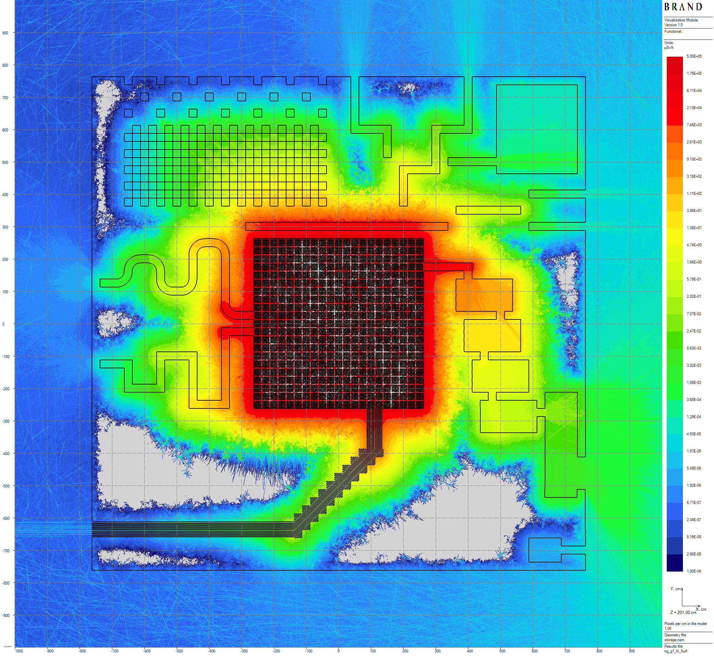
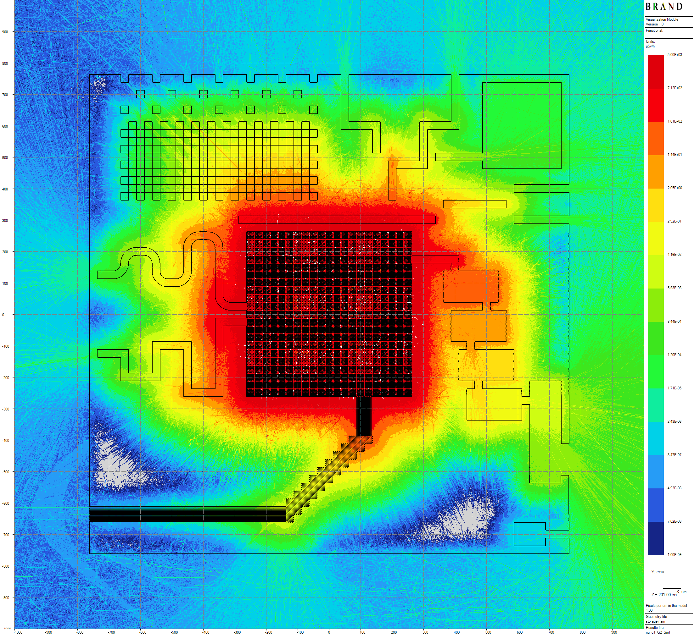
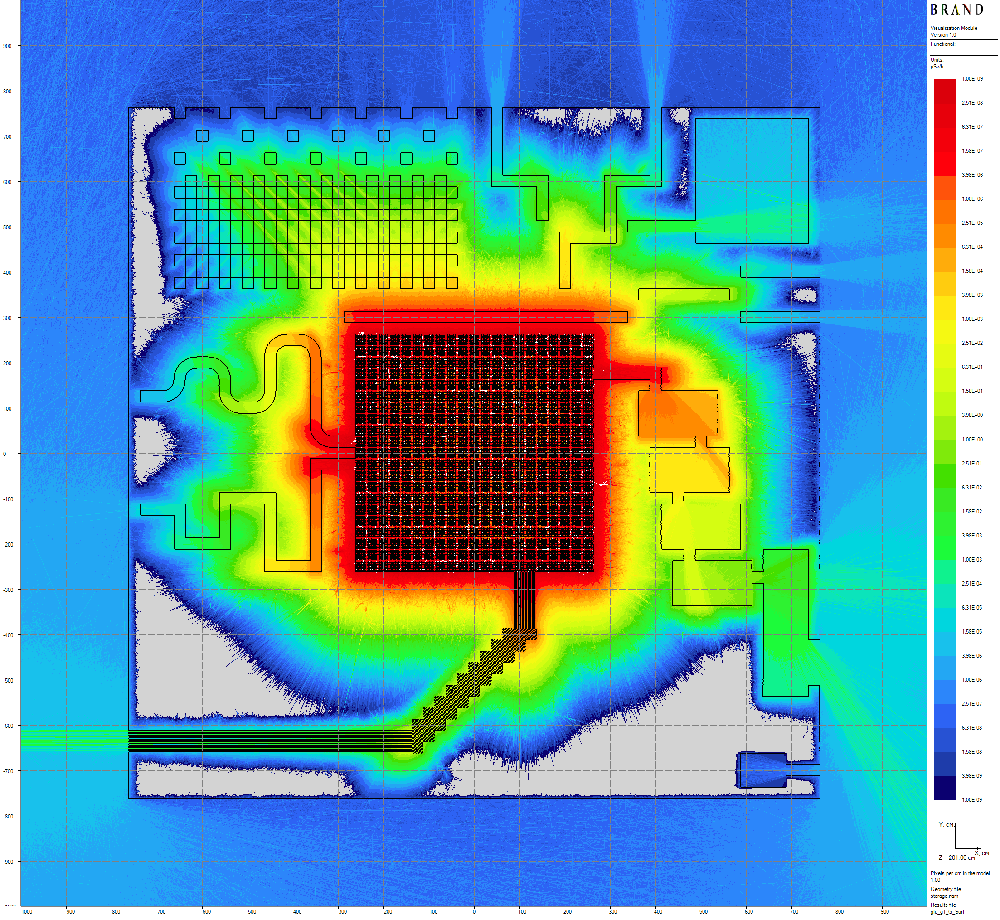

[Prev](castor-v21-mult-case.md) [**.....**](shielding-evaluations.md#computations-results) [Next](anthill-steel.md)

# Concrete Anthill toy model

This model imitates a hypothetical large spent fuel dry storage. It has heterogeneous concrete shields including numerous labyrinths, rooms, and cavities of intractable configurations. An interesting feature of the designed problem is the relatively strong attenuation of dose rates for both neutrons and gamma radiation which magnitudes reach $10^{-15} - 10^{-19}$. In combination with a large heterogeneous self-shielded source, that makes this problem suitable for practicing in variance reduction techniques for full-scale shielding evaluations.

The model is based on a regular $61 \times 61$ lattice of $25 \times 25 \times 410$ cm prisms. In the central $21 \times 21$ cells fragment, 441 PWR spent fuel assemblies from the [CASTOR-V/21](castor-v21.md) model are placed. The remaining part of the model is a complex heterogeneous shield and its prisms are filled with either concrete or air (see Figure 1). In total, shield thicknesses in each side direction are equal to 500 cm but shield thickness of the monolite concrete slab in the top direction is 400 cm.

||
|:--:|
| Figure 1: Horizontal model cross-section |

Computed flux functional - ambient equivalent dose H*(10) [1] rates, thickness of volumetric detectors are 100 cm.
Below, some results of neutron-gamma and gamma problems 24.3 hours long computation are presented  (see details in [2]).

||
|:--:|
| Figure 2: Neutron horizontal dose rates distribution |

||
|:--:|
| Figure 3: Secondary gamma horizontal dose rates distribution |

||
|:--:|
| Figure 4: Primary gamma horizontal dose rates distribution |

[Prev](castor-v21-mult-case.md) [**.....**](shielding-evaluations.md#computations-results) [Next](anthill-steel.md)

# References
1. International Commission on Radiological Protection., International Commission on Radiation Units,
and Measurements. Conversion coefficients for use in radiological protection against external radiation.
Annals of the ICRP ; v. 26, no. 3/4. Published for the Commission by Pergamon Press, Oxford ;, 1st
ed. edition, 1996 - 1997.
2. V.G. Mogulian. An approach to radiation shielding evaluations using estimators by expected scoring. 2025. [doi:10.5281/zenodo.16781417](https://doi.org/10.5281/zenodo.16781417).

Copyright &copy; 2025 Vitaly Mogulian
