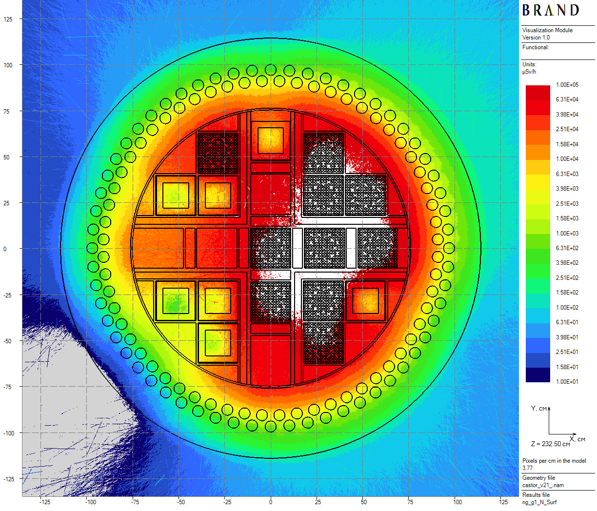
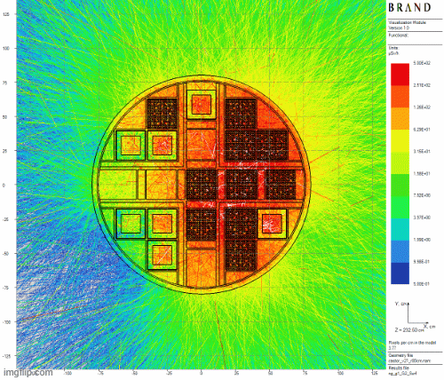
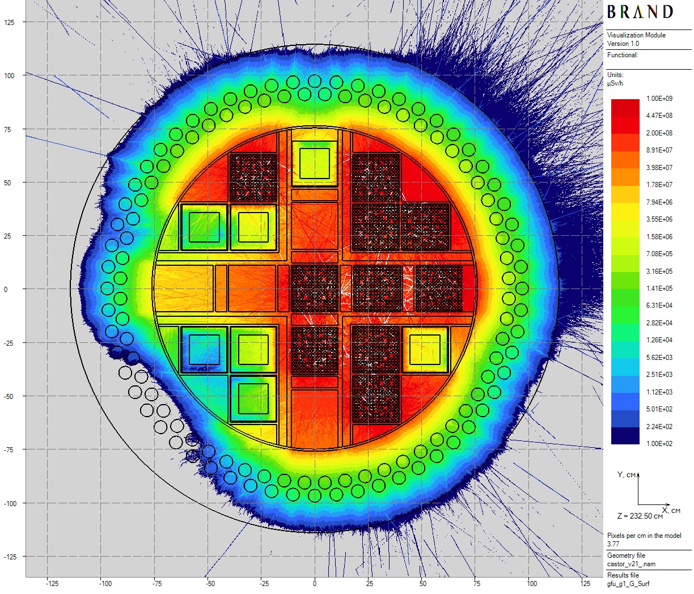

[Prev](castor-v21.md) [**.....**](shielding-evaluations.md#computations-results) [Next](anthill.md)

# CASTOR-V/21 multicase computations

Using the given in [section](castor-v21.md) conditions for the single cask, those are additionally considered 4 cases for each type of radiation of the cask side wall shield cut by cylindrical surfaces. These 5 cases in total has been completed in a single computation of total running time - 12.1 hours.

Computed flux functional - ambient equivalent dose H*(10) [1] rates.

Below, results of neutron-gamma and gamma problems computations are performed.

||
|:--:|
| Figure 1: Neutron axial dose rates distributions for the single cask |

||
|:--:|
| Figure 2: Secondary gamma axial dose rates distributions for the single cask |

||
|:--:|
| Figure 3: Primary gamma axial dose rates distributions for the single cask |

[Prev](castor-v21.md) [**.....**](shielding-evaluations.md#computations-results) [Next](anthill.md)

# References
1. International Commission on Radiological Protection., International Commission on Radiation Units,
and Measurements. Conversion coefficients for use in radiological protection against external radiation.
Annals of the ICRP ; v. 26, no. 3/4. Published for the Commission by Pergamon Press, Oxford ;, 1st
ed. edition, 1996 - 1997.

Copyright &copy; 2025 Vitaly Mogulian