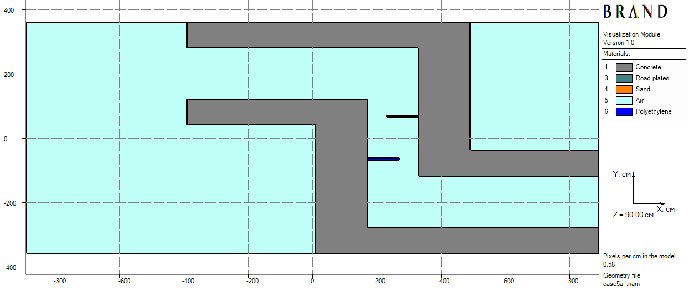
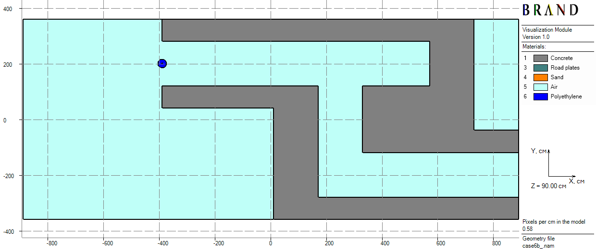
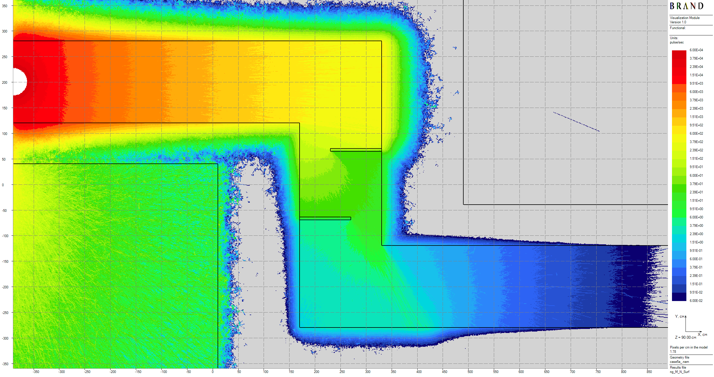
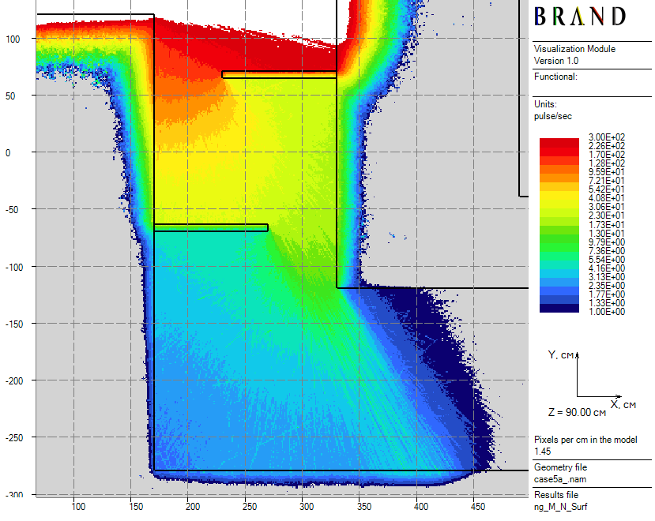
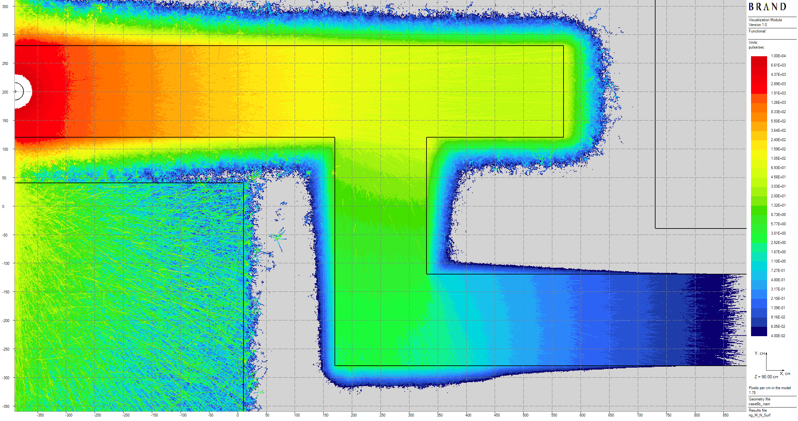

[Prev](ueki-experiments.md) [**.....**](shielding-evaluations.md#computations-results) [Next](castor-v21.md)

# Protvino concrete labyrinth benchmark (ALARM-CF-AIR-LAB-001)

A californium-252 neutron source of intensity $5.66 \cdot 10^8$ n/s is located at entrance to a 3-section concrete labyrinth [1].
The goal is computation of spatial distribution of a neutron flux linear functional which is determined via a fluence-to-energy response funtion and relates to the Bonner sphere detector count rates.
Those are considered below just two of the most problematic cases among represented in the original work [1]: Case 5A (2 polyethylene plates in the 2nd section) and Case 6B (covered source and dead-end).

In this calculation, the following techniques are used:
 - Expected value estimators;
 - Simplified adaptive splitting.

The primary computational gain is achieved here thanks to the _simplified adaptive splitting_  technique.

Computed flux functional - pulse rate by the detector response function is taken from the benchmark data for the case of 5 in. Bonner polyethylene sphere diameter.

||
|:--:|
| Figure 1: Horizontal cross-section of Case 5A model |

||
|:--:|
| Figure 2: Horizontal cross-section of Case 6B model |

Thicknesses of volumetric detectors are equal to 10 cm.
Results of the two 11.2 hours long concurrently ran computations are performed in Figures 3-5 (see details in [2]).

||
|:--:|
| Figure 3: Global plot of count rates spatial distribution for Case 5A, pulse/sec |

||
|:--:|
| Figure 4: Local plot of count rates spatial distribution for Case 5A, pulse/sec |

||
|:--:|
| Figure 4: Plot of count rates spatial distribution for Case 6B, pulse/sec |

[Prev](ueki-experiments.md) [**.....**](shielding-evaluations.md#computations-results) [Next](castor-v21.md)

# References
1. Mark Nikolaev, Natalia Prokhorova, Tatiana Ivanova, “Neutron Fields in Three-Section Concrete
Labyrinth from Cf-252 Source,” ALARM-CF-AIR-LAB-001, “International Handbook of Evaluated Criticality
Safety Benchmark Experiments,” OECD Nuclear Energy Agency, NEA-1486/19, 2021 (DVD).
2. V.G. Mogulian. An approach to radiation shielding evaluations using estimators by expected scoring. 2025. [doi:10.5281/zenodo.16781416](https://doi.org/10.5281/zenodo.16781416).

Copyright &copy; 2025-2026 Vitaly Mogulian. All rights reserved. [Legal Status & IP Statement](LEGAL.md).
