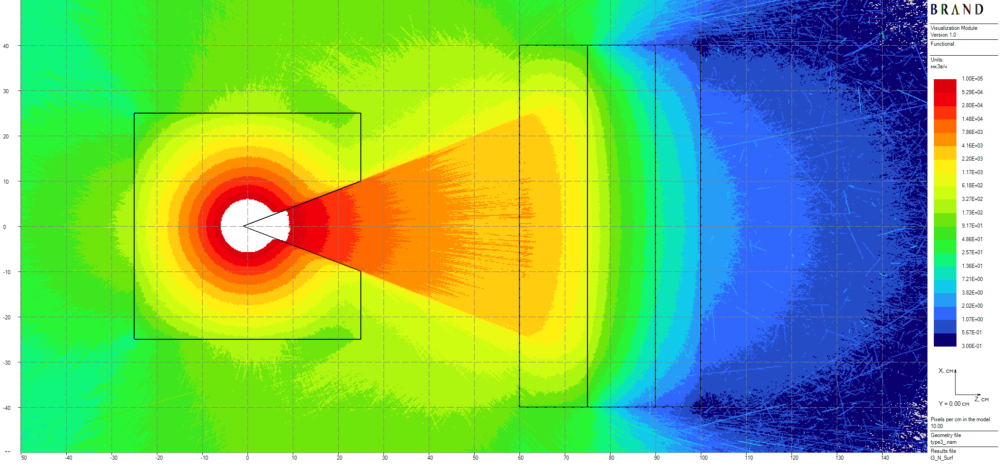
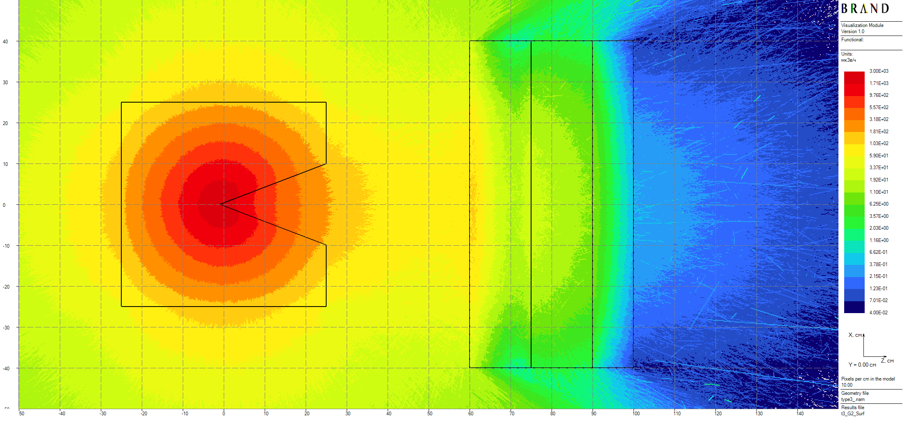

# Ueki shielding experiment (Type 3)

A californium-252 neutron source of intensity $5.33 \cdot 10^8$ n/s is placed into a conic paraffinn collimator.
The goal is computation of neutron and secondary (capture) gamma dose rates behind 3-layered shield
 of steel (25 cm) - polyethylene (15 cm) - steel  (10 cm) slabs.

Computable flux functional - rates of equivalent dose ANSI77 [2].

Thicknesses of volumetric detectors are equal to 2 cm. Results of a 2 h 52 min long computation are given in Figures 1 and 2.

||
|:--:|
| Figure 1: Neutron ANSI77 dose rates plot, μSv/h |

||
|:--:|
| Figure 2: Secondary gamma ANSI77 dose rates plot, μSv/h |

[Back to top](shielding-evaluations.md)

# References
1. K. Ueki, A. Ohashi, Nobuteru Nariyama, S. Nagayama, T. Fujita, K. Hattori, and Y. Anayama.
Systematic evaluation of neutron shielding effects for materials. Nuclear Science and Engineering,
124:455–464, 10 1996.
2. American National Standard: neutron and gamma-ray ux-to-dose rate factors. American Nuclear
Society, United States, 1977.

Copyright &copy; 2025 Vitaly Mogulian